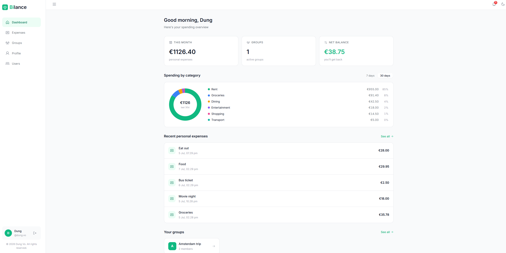
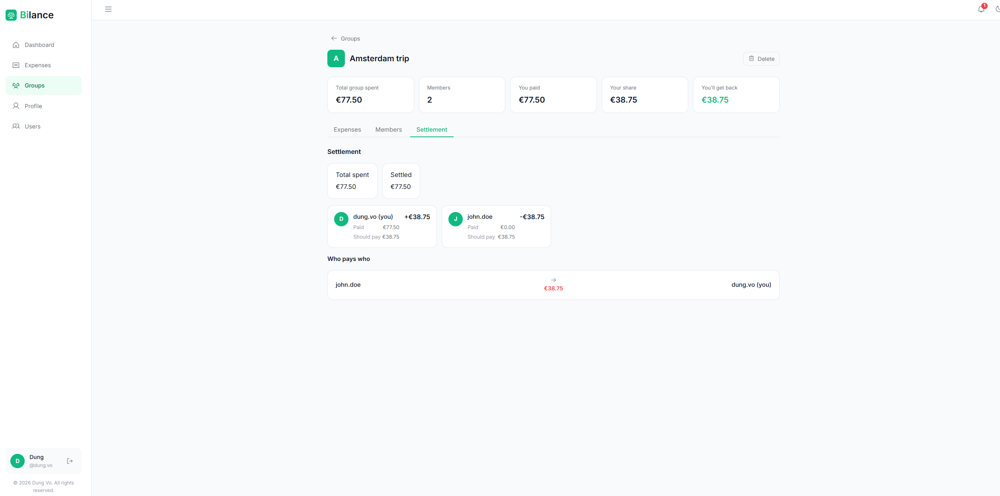

# Bilance

[](https://github.com/dung-vo01/bilance/actions/workflows/ci.yml)

A full-stack expense tracker for splitting shared costs with friends,
roommates, or any group - personal expenses and group expenses with
custom split ratios, invites, and a settlement view showing who owes who.

**<a href="https://bilance.vercel.app/" target="_blank" rel="noopener noreferrer">Live demo</a>**

> **Note:** the backend is on a free-tier host and spins down when idle, so
> the first request can take up to a minute to wake it back up. The app
> shows a "waking up the server" message during that wait so it doesn't
> look stuck; subsequent requests are fast.

## Screenshots




## Features

- Auth with JWT access/refresh tokens, email verification, and password reset
- Guest mode - try the app instantly with a pre-seeded sandbox account, no
  signup required
- Personal expense tracking - search, sort, filter by category/status,
  paginated
- Expense groups - create, invite by username, accept/decline, admin
  controls
- Per-expense split ratios, independent of a group's default ratio
- Settlement view - who owes who, and by how much
- Global and per-group expense categories
- Notifications for invitations and membership changes, with email
  notifications for group invitations

## Tech stack

- **Frontend** - React, TypeScript, Vite, TanStack Query, Zustand, SCSS modules
- **Backend** - FastAPI, SQLAlchemy 2.0 (async), PostgreSQL, Alembic
- **Auth** - JWT (access + refresh), bcrypt password hashing, email
  verification via SendGrid

## Project structure

```
backend/    FastAPI app  - see backend/README.md
frontend/   React app    - see frontend/README.md
docs/       design notes (expense sharing & settlement rules)
```

## Getting started

Follow the setup steps in [`backend/README.md`](backend/README.md) and
[`frontend/README.md`](frontend/README.md) to run the API and the app
locally.

## Roadmap

- Recurring payments
- Payment due-date reminders
- Phone number registration
- Receipt image upload with AI-assisted data extraction

## License

&copy; 2026 Dung Vo. All rights reserved.
